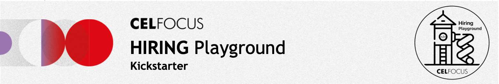

# E-Commerce Application Showcase - Celfocus

<div align="center">
  
</div>

## 🚀 Project Overview

This repository contains a full-stack e-commerce application built to provide a seamless and modern shopping experience. The frontend is a responsive Next.js application, and the backend is a robust Spring Boot API. This document details the project's features, architecture, and instructions for running, testing, and exploring the codebase.

### Core Features Implemented

- ✅ **Product Catalog:** A responsive grid displays products fetched from the backend.
- ✅ **Add to Cart:** Users can add products to their shopping cart with a single click.
- ✅ **Shopping Cart Dropdown:** A cart icon with a dropdown menu allows users to view and manage their cart items.
- ✅ **Responsive Design:** The application is fully responsive, providing an optimal viewing experience across desktops, tablets, and mobile devices.
- ✅ **PWA & Offline Support:** The application is a Progressive Web App (PWA), with a service worker for offline capabilities. Users receive notifications when the app is online or offline.
- ✅ **Storybook Component Library:** UI components are documented and explorable through Storybook.

---

## 📂 Project Structure

Here is a high-level overview of the project's structure:

```
hiring-playground-main/
│
├── backend/            # Spring Boot REST API
│   └── src/
├── frontend/           # Next.js Monorepo
│   └── modules/
│       ├── app/        # Main application (pages, components)
│       ├── components/ # Shared UI components & Storybook
│       └── services/   # Data services
└── mocks/              # Mock server for backend APIs
```

---

## 💻 Getting Started

### Prerequisites

- [Docker](https://www.docker.com/get-started)
- [Docker Compose](https://docs.docker.com/compose/install/)
- An IDE/Editor such as [Visual Studio Code](https://code.visualstudio.com/download) or [IntelliJ IDEA](https://www.jetbrains.com/idea/download/)

### Running the Application

To get the application up and running, you have two options:

**Option 1: Standard Mode**

This command builds the containers and starts the application.

1.  Clone this repository to your local machine.
2.  Navigate to the project's root directory.
3.  Run the following command:

    ```bash
    docker-compose up --wait
    ```

**Option 2: Watch Mode (for development)**

This command starts the services in watch mode, automatically rebuilding them when you make changes to the code.

1.  Clone this repository to your local machine.
2.  Navigate to the project's root directory.
3.  Run the following command:

    ```bash
    docker compose up --watch
    ```

After running either command, the services will be available at:

- **Frontend:** [http://localhost:4200](http://localhost:4200)
- **Backend API:** [http://localhost:8080](http://localhost:8080)
- **Mock Server API:** [http://localhost:8082](http://localhost:8082)

---

## 🧪 Running Tests

The frontend includes a suite of tests to ensure code quality and functionality. To run the tests:

1.  Navigate to the frontend application directory:
    ```bash
    cd frontend/modules/app
    ```
2.  Run the test command:
    ```bash
    npm test
    ```

---

## 🎨 Storybook

The project uses Storybook to document and showcase the UI components.

To launch Storybook:

1.  Navigate to the components module directory:
    ```bash
    cd frontend/modules/components
    ```
2.  Run the Storybook command:
    ```bash
    npm run storybook
    ```

Storybook will be available at [http://localhost:6006](http://localhost:6006).
